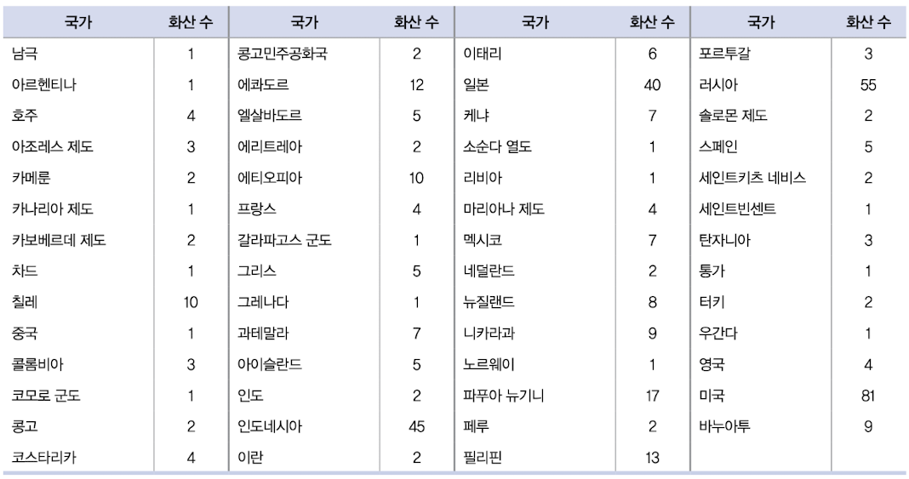
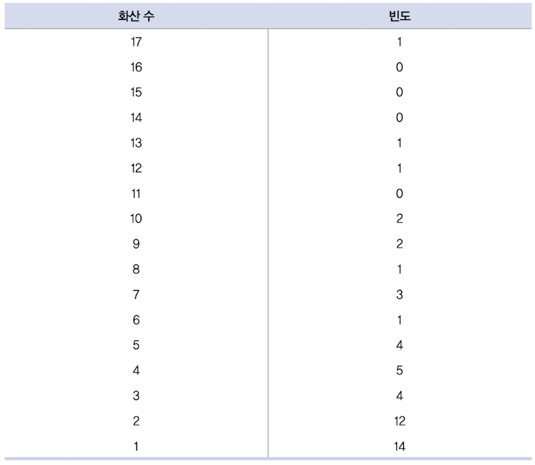
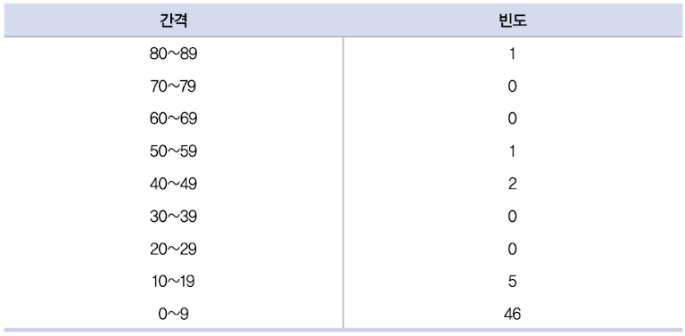
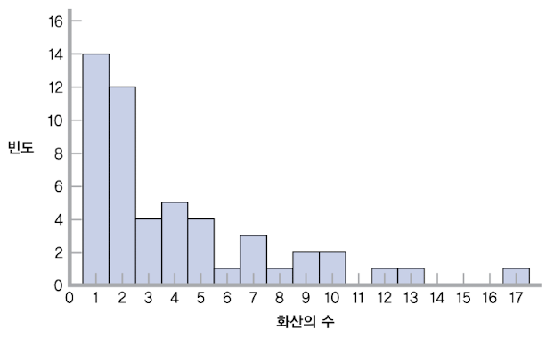
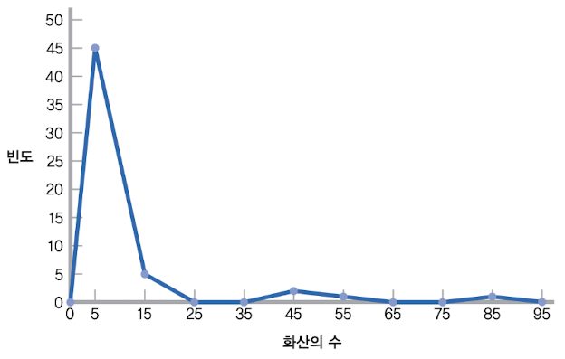
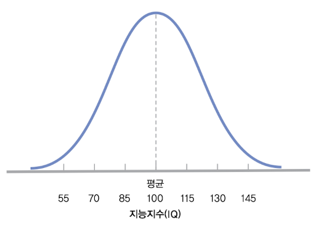
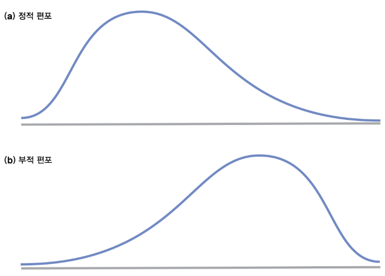

# 2 빈도분포

각 variable이 갖는 관계를 이해하기 위해서는 우선 각 variable의 data value를 이해해야 한다. 

data set의 기본 성분, 즉 아직 변환하거나 분석하지 않은 data를 **raw score**(원점수)라고 부른다. 

통계에서는 raw score을 **frequency distribution**(빈도분포)로 체제화하는데, frequency distribution은 한 variable이 가능한 value 각각에 대해 집계한 사례 수나 비율을 나타내는 것으로 data set의 패턴을 표현한다.

---

## 2.1 frequency table(빈도표)

각 data 값이 얼마나 자주 발생하는지, 각 값에 얼마나 많은 사례가 존재하는지 시각적으로 보여주는 table을 의미한다.

빈도표는 다음과 같은 단계를 통해 만든다.

1. 최고 score와 최저 score를 결정한다.

> 최고, 최저 score을 결정하고 outlier(이상치)에 해당하는 값을 사용하지 않는다.

2. 두 column을 만든다. 첫 번째 column은 variable의 이름, 두 번째 column은 빈도를 적는다.

3. 데이터의 모든 score을 내림차순으로 나열한다.(빈도가 0인 값도 포함한다.)

4. 각 값에 해당하는 score 수를 세어, 빈도 열에 기록한다.

가령 아래 전 세계의 화산 수를 빈도표로 나타내고 싶다고 하자.

이를 score를 1~17 범위로 정한다면, 빈도표는 아래와 같이 작성할 수 있다.

세 번째 column으로 백분율을 넣을 수 있다. 가령 1~17 범위에 해당하는 51개의 나라에서 17개의 화산을 갖는 국가(파푸아 뉴기니 하나)의 백분율은 다음과 같다.

$$ {1 \over 51}(100) = 1.961 $$

하지만 실제 data는 이렇게 용이하게 정리되지 않기 십상이다. 반응 시간처럼 소숫점 이하 여러 자리를 갖거나, 데이터나 굉장히 넓은 범위에 걸쳐 있는 등 이런 상황에서는 빈도표로 나타내기 힘들 것이다.

이런 문제를 해결하기 위해 grouped frequency table(묶은 빈도표)를 사용할 수 있다.

---

## 2.2 histogram(히스토그램)

히스토그램은 막대그래프와 모양이 유사하지만, <U>단 하나의 variable만 묘사한다.</U> 일반적으로 variable의 값을 x축에, 빈도를 y축에 나타낸다.

> 주로 하나의 scale variable(척도 변인)의 빈도를 제공한다.

만약 묶은 빈도표를 x축으로 사용하려면, 중앙값을 대신 표기하면 된다. 다만 중앙점을 결정할 때 간격의 하한을 생각하지 않으면 실수를 저지르기 쉽다.

가령 0~4까지의 범위에서 중앙값을 표기한다고 하자. 여기서 2로 정한다면 실수를 저지른 것이다. 이 간격은 0.000000에서 4.99999까지거나, 간격의 하한이 5가 아니면서 5에 아주 근접한 score일 수도 있다. 만약 이 범위에 (0, 1, 2, 3, 4) 5개 수치가 있다면 중앙점은 2.5이다.

---

## 2.3 frequency polygon(빈도다각형)

히스토그램과 유사하지만 선그래프다. x축은 값(또는 간격의 중앙점), y축은 빈도를 나타낸다.

주의할 점은 연결선이 0에 도달해서 다각형이 닫힌 도형이 되도록 그래프 양극단에 적절한 값을 첨가할 필요가 있다.

가령 첫 번째 중앙점을 -5로 만들지 않고, 0에서 시작하게 그린다.(-5개 화산을 가질 수는 없다.)

---

## 2.4 분포의 모양

### 2.4.1 normal distribution(정규분포)

통계에서 normal(정상)이란 단어는 매우 특별한 방식으로 사용한다. **normal distribution**(정규분포, Gaussian distribution)는 대칭을 이루는 산 모양에 봉우리가 하나인 독특한 빈도분포 곡선을 말한다.

---

### 2.4.2 skewed distribution(편중분포)

**skewed distribution**(편중분포)는 분포의 <U>꼬리 하나가 중앙에서 멀리 떨어진</U> 분포이다. 

distribution이 정적으로 편중(positive skewed)되어 있다는 말은, 오른쪽 꼬리가 중앙에서 멀리 떨어진 모양을 뜻한다. 주로 **floor effect**(바닥 효과)가 있을 때 발생한다.

> floor effect(바닥 효과)란 variable이 특정 값 이하가 될 수 없게 어떤 제약요인이 작용하는 상황을 말한다.

반대로 distribution이 부적으로 편중(negative skewed)되어 있다는 말은, 왼쪽 꼬리가 중앙에서 멀리 떨어진 모양을 뜻한다. 주로 **ceiling effect**(천장 효과)가 있을 때 발생한다.

> ceiling effect(천장 효과)란 variable이 특정 값 이상이 될 수 없게 어떤 제약요인이 작용하는 상황을 말한다.

---