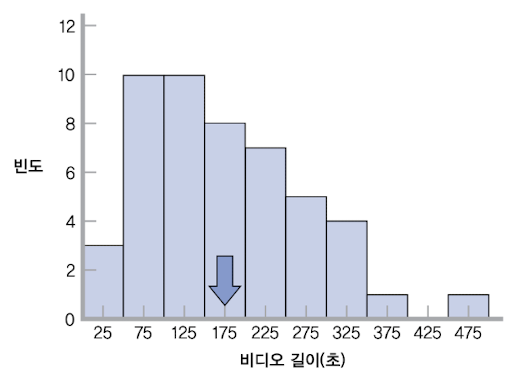

# 4 집중경향과 변산성

## 4.1 central tendency(집중 경향)

**central tendency**(집중경향)이란 data set의 중심을 가장 잘 나타내는 '기술통계치', 즉 <U>다른 모든 데이터가 수렴하는 것으로 보이는 특정한 값</U>을 지칭한다.

> 주로 distribution을 시각적으로, 즉 그래프를 그리면 잘 나타난다.

central tendency는 세 가지 방식, 평균, 중앙값, 최빈값으로 측정할 수 있다.

하나의 분포가 central tendency에서 얼마나 벗어나 있는지를 측정하기 위해 쓰이는 개념이 바로 범위, 분산, 표준편차이다.

---

### 4.1.1 mean(평균)

산술에서의 **mean**(평균)은 '모든 score의 합 / score 총 개수'로 계산한다.

이런 평균을 기호 표기법으로 나타낼 수 있다. 통계에서 sample의 mean은 주로 다음과 같이 나타낸다.

- $M$ or $\overline{X}$ : sample의 mean. (이텔릭체 대문자를 사용해야 한다.)

- $\mu$ : population의 mean

> 보통 $M$ 과 같이 라인어 문자는 sample 수치를 나타내고, $\mu$ (뮤) 와 같은 그리스어 문자는 population 수치를 지칭하는 경향이 있다.

이때 <U>sample에서 근거한 수치</U>를 **statistic**(통계치)라고 하며, <U>population에서 근거한 수치</U>를 **parameter**(모수치)라고 한다.

따라서 등식을 기호 표기법을 이용해 나타내면 다음과 같다.

$$ M = {{\sum X} \over N} $$

- $X$ : 단일 score를 의미한다.

---

### 4.1.2 median(중앙값)

**median**(중앙값)은 sample에 있는 모든 score을 ascending sort(오름차순)으로 sort할 때 중앙에 해당하는 score를 뜻한다. $Mdn$ 으로 표기하기도 한다.

probability distribution(확률 분포)에서는 실수 $m$ 이 다음 식을 만족할 때, 그 값을 확률분포 $P$ 의 median으로 정의한다.

$$ P(X \le m) \ge {1 \over 2} \, \, \land \, \, P(X \ge m) \ge {1 \over 2} $$

---

### 4.1.3 mode(최빈값)

**mode**(최빈값)은 sample의 모든 score 중에서 가장 빈번한 score를 뜻한다. 어떤 약자도 존재하지 않는다.

점수분포가 하나의 mode를 갖는 경우를 **unimodal**(단봉)이라고 하며, 두 개의 mode를 가지면 **bimodal**(쌍봉), 세 개 이상이면 **multimodal**(다봉)분포라고 한다.

---

### 4.1.4 최선의 central tendency는?

대체로 mean과 median 사이에서 결정하게 된다. 대체로 mean이 우위를 차지할 때가 많으며, 주로 data가 많을 때 특히 그렇다. 

하지만 outlier가 분포를 편중시킬 때나, 지극히 적은 data가 있을 때는 median이 더 central tendency를 더 잘 대표할 수도 있다.

mode는 주로 다음과 같은 세 가지 상황에서 사용한다. 

- 한 특정 score가 distribution을 주도할 때 

- distribution이 bimodal이나 multimodal일 때

- **nominal variable**(명목변인)일 때, 어느 측정치가 최선의 central tendency인지 확신이 서지 않을 때

> central tendency는 단일 수치만으로 엄청난 양의 정보를 전달하기 때문에, 가장 광범위하게 사용하는 descriptive statistic이다. 하지만 평균의 함정에 속아 넘어가기도 한다.

---

## 4.2 variability(변산성)

**variability**(변산성)이란 <U>distribution이 얼마나 많이 퍼져있는지</U>를 수치로 나타낸 것이다. 보통 variance(분산)을 계산하고, variance의 제곱근인 standard deviation(표준편차)을 구하는 방식을 이용한다.

---

### 4.2.1 range(범위)

**range**(범위)란 '최고 score - 최저 score'으로 나타내는 variability를 뜻한다. range는 얼마나 넓게 퍼져있는지는 알 수 있으나, score가 어떤 패턴을 가지고 있는지는 알 수 없다.

---

### 4.2.2 variance(분산, 변량)

**variance**(분산, 변량)이란 **deviation**(편차, 각 score가 mean에서 벗어난 정도) 제곱의 평균이다.

> 굳이 제곱의 평균으로 정의하는 이유는, deviation의 합은 항상 0이므로 deviation의 평균 역시 0이 되어 버리기 때문이다.

따라서 variance 값이 작다면 mean에서 적은 양의 확산이 일어난 distribution일 것이며, variance 값이 크다면 mean을 중심으로 많은 양의 확산이 일어난 distribution을 갖는다.

기호로 나타내면 다음과 같다.

$$ SD^{2} = {{\sum{(X-M)}^{2}} \over N} $$

- $X - M$ : deviation from the mean(평균으로부터의 편차)

- $SD^{2}, s^{2}, MS$ : variance, Standard Deviation의 제곱 혹은 Mean Square(평균 제곱)에서 유래했다.

---

### 4.2.3 standard deviation(표준편차)

**standard deviation**(표준편차)란 deviation 제곱 평균의 제곱근, 즉 variance의 제곱근을 의미한다.

> variance와 비교해서 standard deviation은 '퍼져있는 정도'를 한번에 이해할 수 있다.

기호로는 다음과 같이 나타낸다.

$$ SD = \sqrt{SD^2} = \sqrt{{\sum(X-M)^2} \over N} $$

---