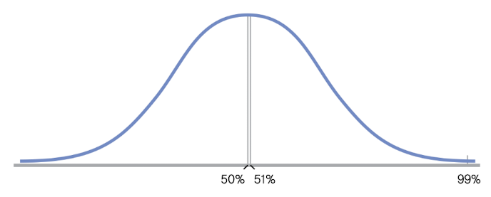
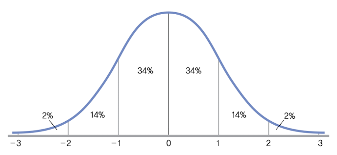
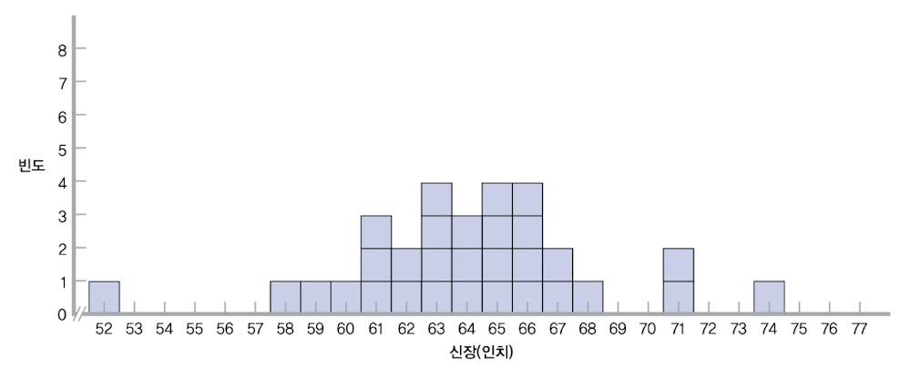
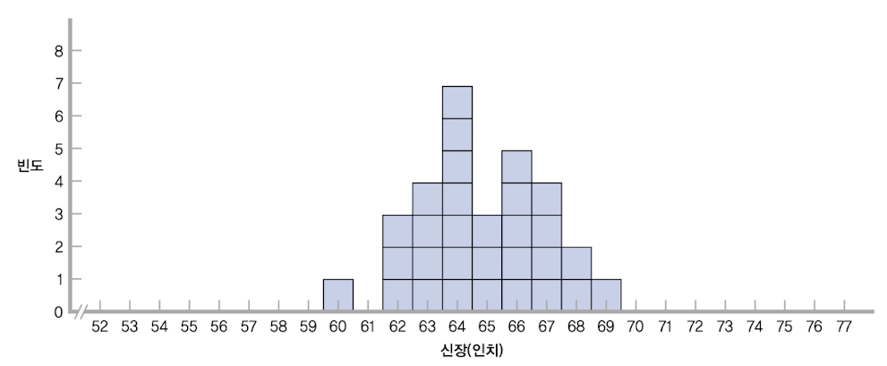
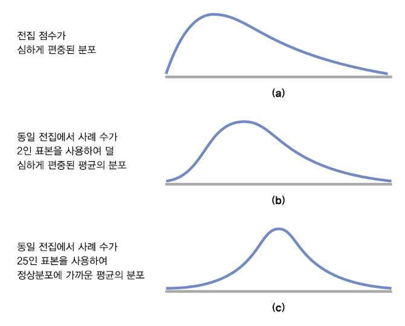

# 6 정상곡선, 표준화, z점수

normal curve(정상곡선), 즉 normal distribution(정규분포)는 통계학에서 굉장히 강력한 도구다. 

---

## 6.1 standardization(표준화)

**standardization**(표준화)란 <U>다른 normal distribution에 들어있는 개별 score를</U>, 이미 mean, standard deviation, percentile(백분위수)를 알고 있는 <U>공통의 normal distribution으로 변환</U>하는 방법이다.

비교를 할 때 직면하는 첫 번째 문제점은 variable들을 다른 척도에서 측정했다는 점이다. 

> 예를 들어 키는 cm, 체중은 kg 단위로 측정했다면, 이 상이한 variable을 비교하기 위해 standardization이 필요하다.

mean과 standard deviation을 이용하여 raw score를 $z$ **score**(z 점수)로 변환하면, 이런 상이한 variable을 standardization할 수 있다.

- $z$ score

$z$ score는 특정 score가 mean에서 떨어져 있는 정도(deviation)를 <U>standard deviation 수치로 나눈 값</U>을 뜻한다. (다른 기호와 마찬가지로 이텔릭체로 표기한다.)

만약 어떤 score가 mean보다 1.6 standard deviation만큼 아래 위치한다면, 그 score의 $z$ score는 -1.6이다. 평균이라면 $z$ score은 0이다.

기호로 표기하면 다음과 같다.

$$ z = {(X-\mu) \over {\sigma}} $$

- $X$ : 단일 score 값

- $\mu$ : sample의 mean

- $\sigma$ : sample의 standard deviation

반대로 해당 score의 $z$ score, mean, standard deviation을 알면 raw score을 구할 수도 있다.

---

### 6.1.1 $z$ distribution(z 분포)

이제 standardization을 통해 '사과 크기를 조사한 sample'과 '오렌지 크기를 조사한 sample'을 비교할 수 있게 되었다.

사과의 normal distribution에서 어떤 사과를 택해서 $z$ score을 구하고, 그 $z$ score을 percentile(백분위수)로 변환하면 사과가 sample에서 얼마나 큰지 말할 수 있다.

> 예를 들어 "특정 사과가 모든 사과 85%보다 크다.", "특정 오렌지가 모든 오렌지 97%보다 크다." 라면, 오렌지는 sample 관계 측면에서 사과보다 앞서는 것이다.

이처럼 standardization을 통해 어느 score든 각자가 속한 집단 측면에서 비교할 수 있다. 여기서 보다 세부적인 비교를 하려면 $z$ **distribution**(z 분포)를 이용할 수 있다.

- $z$ distribution

$z$ distribution이란 <U> $z$ score의 distribution</U>(즉, 표준편차들의 분포)이다.

이때 $z$ score의 normal distribution을 '**standard normal distribution**(표준정규분포)'이라고 부른다.

비교 과정을 다시 표현하면, $z$ distribution을 사용해서 raw score를 $z$ score로 변환한 뒤, 다시 $z$ score을 percentile로 변환하는 과정을 거친 것이다.

---

### 6.1.2 standard normal distribution

위에서 정의한 대로 standard normal distribution은 $z$ score들의 distribution이기 때문에, distribution의 중심 위치와 scale이 같아지게 된다.

- mean $\mu$ 가 0으로 scaling된다.(deviation이 0이 되는 지점이, 바로 mean이 위치한 지점이기 때문)

- 표준정규분포의 standard deviation $\sigma$ 는 1이 된다.(즉, 표준 정규분포의 variance $\sigma^2$ 도 1)

standard normal distribution(표준정규분포)는 다음과 같은 작업을 가능하게 해준다.

1. raw score를 $z$ score로 변환한다.

2. $z$ score를 다시 raw score로 변환한다.

3. raw score가 서로 다른 척도로 측정된 집합이라도, $z$ score을 이용해 비교할 수 있다.

4. $z$ score를 보다 쉽게 이해할 수 있는 percentile로 변환한다.

---

 

### &nbsp;&nbsp;&nbsp;📝 예제 6.9: 강의별 점수 비교하기(z score 사용)&nbsp;&nbsp;&nbsp;

학생 A와 B가 서로 다른 분반에서 시험을 본다. 각각 다음과 같은 시험 결과를 얻었다.

- 학생 A: 92점(100점 만점) / mean $\mu$ 는 78.1점 / standard deviation $\sigma$ 는 12.2

- 학생 B: 8.1점(10점 만점) / mean $\mu$ 는 6.8점 / standard deviation $\sigma$ 는 0.74

### &nbsp;&nbsp;&nbsp;🔍 풀이&nbsp;&nbsp;&nbsp;

점수를 standardization하자.

- 학생 A

$$ z = {{X - \mu} \over {\sigma}} = {(92 - 78.1) \over {12.2}} = 1.14 $$

- 학생 B

$$ z = {{X - \mu} \over {\sigma}} = {(8.1 - 6.8) \over {0.74}} = 1.76 $$

따라서 학생 B가 상대적으로 학생 A보다 높은 성취를 이루었다.

---

### 6.1.3 standard normal distribution의 면적

standard normal distribution을 percentile로 나타내면 더 유용하게 사용할 수 있다. 아래 그림처럼 곡선 아래 면적을 계산함으로써, 특정 영역이 차지하는 백분율을 알 수 있다.

- 대략 34%의 score가 mean과 $z$ score 1.0 사이에 존재한다.(대칭적이기 때문에 mean과 $z$ score -1.0 사이도 마찬가지다.)

- 대략 14%의 score가 $z$ score 1.0과 2.0 사이에 존재한다.

- 다시 말해 대략 68%(34*2)가 mean에서 1 standardization 내 위치하며, 대략 96%가 2 standardization 내, 100%에 가깝게 3 standardization 내 위치한다.

---

## 6.2 Central limit theorem(중심극한정리)

**central limit theorem**(중심극한정리)는 <U>population이 normal distribution을 나타내지 않을 때조차</U>, 'sample mean의 distribution'이 '개별 score들의 distribution'보다 normal distribution에더 근사하게 된다는 사실을 의미한다.

정리하자면 다음과 같다.

1. population이 normal distribution을 이루지 않아도, 반복적인 sampling은 normal distribution에 근접한다.

2. mean들의 distribution은 개별 score의 distribution보다 덜 가변적이다.

따라서 동일한 population에서 sampling을 반복해서 나온 sample들의 mean으로 구성된 distribution, 즉 **distribution of means**(평균분포)는 normal distribution에 근접한다.

또한 이런 distribution of means에서 구한 $z$ score를 $z$ statistic(z 통계치)라고 부른다.

---

### 6.2.1 distribution of means 생성하기

기존 score를 이용한 distribution과, score들의 mean을 이용한 distribution을 비교할 것이다. 

예를 들어 학생들 140명(population)의 키에 해당하는 숫자가 적힌 카드 140장이 상자에 들어 있다고 하자. 

1. 상자에서 카드 30장을 뽑는 sampling

이때 카드를 한번 뽑았다면, 그 카드는 다시 상자에 집어넣고 뒤섞는다. 뽑은 카드에 적힌 숫자는 기록해 둔다.

> 이런 절차를 **sampling with replacement**(복원표집)이라고 한다. 반대는 sampling without replacement(비복원표집)이다.

2. 상자에서 카드 3장을 뽑아서 mean을 계산하는 sampling(소수는 소수점 첫째자리에서 반올림)

마찬가지로 뽑은 3장의 카드는 다시 상자에 집어넣고 섞는다. 3장의 mean에 해당되는 값만 기록한다.

히스토그램으로 나타낸 distribution은 다음과 같다.

1. score distribution(점수분포)

대체로 unimodal한 형태에, 대칭적이긴 하나 normal distribution과 덜 가깝다. 52~74의 range를 갖는다.
 
2. distribution of means(평균분포)

unimodal한 형태에 대칭적이다. 게다가 score distribution보다 더 좁기 때문에 더 작은 standard deviation을 갖는다. 60~69의 range를 갖는다.

이처럼 distribution of means는 variance가 줄어드는 모습을 보인다. score distribution이 거의 outlier에 가까운 score를 distribution에 보인 것과 대조적이다.

> ML에서 IQR(Interquartile range)를 이용해서 percentile의 특정 범위를 벗어나는 score를 outlier로 간주했던 것을 기억하자.

---

### 6.2.2 distribution of means 특성

distribution of means은 score distribution보다 variability가 낮기 때문에, 자체적인 standard deviation이 필요하다. 기호와 함께 보자.

- $\mu_M$ : distribution of means의 mean

  - 값은 population의 mean인 $\mu$ 와 동일하나, 아래 첨자 M을 추가하는 것으로 sampling의 mean이란 사실을 구별해 준다.

- $\sigma_M$ : distribution of means의 standard deviation인 **standard error**(표준오차)를 의미한다.

이때 standard error(표준오차)는 다음과 같이 간단히 계산할 수 있다.

$$ \sigma_M = {{\sigma} \over {\sqrt{N}}} $$

- $N$ : sample의 크기

> 따라서 sample의 크기가 클수록 distribution은 좁아지게 된다.

아래 예시가 표본의 크기에 따라 normal distribution에 근접하는 모습을 보이고 있다.

---

### 6.2.3 central limit theorem을 이용한 $z$ score

앞서 구한 $z$ score은 population에 근거하여 standardization을 한 점수였다. 하지만 실제 실험에서는 population을 가지고 작업하는 경우는 거의 없다.

보통은 sample의 mean을 계산하여 distribution of means을 구한 뒤, 이 distribution of means에 근거한 $z$ score를 사용하게 된다. 이를 $z$ statistic(z 통계치)라고 하며, 기호로 표현하면 다음과 같다.

$$ z = {(M - \mu_M) \over {\sigma_M}} $$

- $M$ : sample의 mean 

- $\mu_M$ : distribution of means의 mean

- $\sigma_M$ : standard error

따라서 $z$ statistic은 sample의 mean이 population의 mean(정확히는 거의 동일한 distribution of means의 mean)에서 얼마나 떨어져 있는지를 나타내게 된다.

---