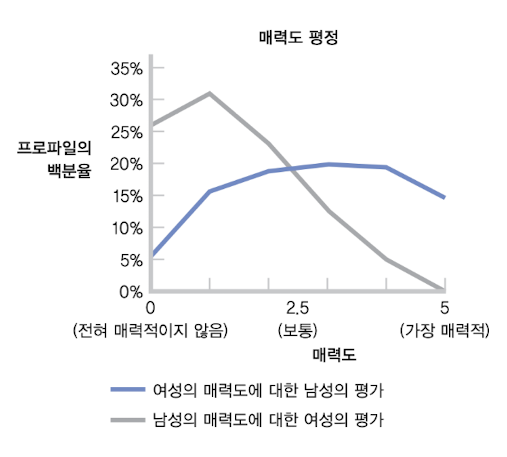
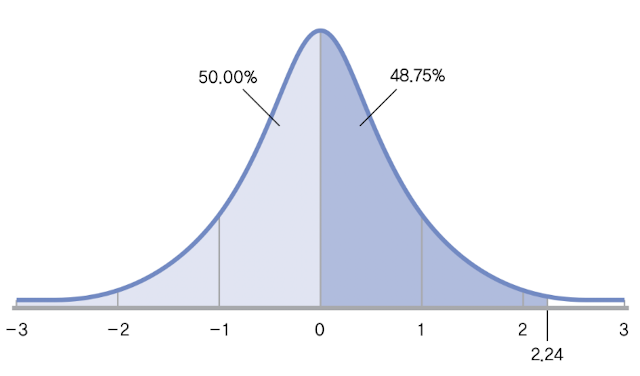
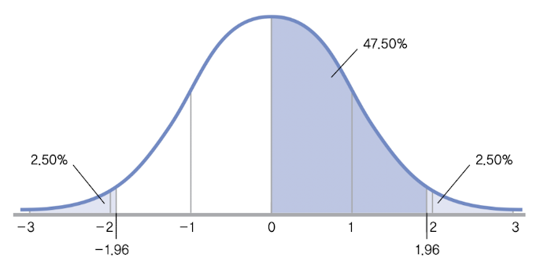

# 7 z 검증을 통한 가설 검증

## 7.1 z 점수표 사용하기

### &nbsp;&nbsp;&nbsp;📝 예제: 특정 사이트에서 제시한 sample의 평균이 population에 유의한지 test하기&nbsp;&nbsp;&nbsp;

실험자가 어느 대학생 매칭 사이트에서 '한 집단의 평균 평가치'에 관심이 있다고 가정하자. 이 사이트에서 여학생 30명의 평가치를 구했다고 하자.

아래는 population에 해당하는 평가 수치다.

- 남성에 대한 여성의 평가는 positive skewed 형태를 띄고 있다.

- 반면 여성에 대한 남성의 평가는 대체로 normal distribution을 이루고 있다.(따라서 $z$ score을 계산할 수 있다.)

  - mean은 2.5, standard deviation은 0.833이다.

이 30명의 평가치 mean은 2.84라고 하자. 

### &nbsp;&nbsp;&nbsp;🔍 풀이&nbsp;&nbsp;&nbsp;

기호 표기법으로 distribution of means의 mean과 standard error를 정리하면 다음과 같다.

$$ \mu_M = \mu = 2.5 $$

$$ \sigma_M = {{\sigma} \over {\sqrt{N}}} = {0.833 \over \sqrt{30}} = 0.152 $$

이 수치를 이용해서 $z$ statistic을 구할 수 있다.

$$ z = {{(M - \mu_M)} \over {\sigma_M}} = {(2.84 - 2.50) \over 0.152} = 2.237 $$

이 $z$ statistic으로 해당 mean의 percentile을 구해 보자.

2.237을 반올림한 값 2.24를 표시하고, 이 이하에 해당하는 공간을 모두 음영으로 표시했다. $z$ 점수표에 따라 mean과 $z$ statistic 2.24 사이의 percentile이 48.75이므로, percentile 순위 98.75%를 얻을 수 있다.

따라서 이 sample의 mean은 상당히 높은 것을 알 수 있다.

> 다만 Hypothesis test(가설검증)을 수행하기 전까지는 아직 이 여학생 sample이 population 평균 2.5와 비교해서 '유의하게' 더 매력적으로 평가받는지 알 수 없다.

---

## 7.2 Hypothesis test(가설 검증)

**assumption**(가정)은 정확한 추론을 위해 sampling을 하는 population에게 요구하는 이상적인 특성을 뜻한다. 

**parametric test**(모수적 검증)이란 population에 관련된 일련의 가정에 근거한 inferential statistic(추론 통계)를 뜻한다. 

반면 **nonparametric text**(비모수적 검증)이란 population에 관련된 일련의 가정에 근거하지 않는 inferential statistic를 뜻한다.

parametric test를 위한 세 가지 핵심 assumption을 보자.

1. scale variable data를 사용하여 dependent variable을 평가한다. 

> 만약 dependent variable이 nominal variable이거나 ordinal variable라면 assumption 1을 만족할 수 없기 때문에 parametric test를 사용해서는 안 된다.

2. 참가자를 random assignment(무선할당)한다.

> assumption 2를 위배하면, sample에서 population으로의 일반화에서 조심해야 한다.

3. population의 distribution은 normal distribution에 근접해야 한다.

> 많은 distribution이 이 assumption 3을 만족하지 못한다. 대신 distribution of means를 사용하면 assumption 3을 달성할 가능성이 높다.

몇몇 assumption을 충족하지 못하는 경우에도 parametric test는 실행 가능하며, 이러한 위배를 극복할 정도로 강건하다. 

> **robust**(강건한) parametric test란 population이 몇몇 assumption을 위배하더라도 꽤 정확한 결과를 내놓는 검증을 뜻한다.

---

### 7.2.1 Hypothesis test의 여섯 단계

가설검증은 다음과 같이 여섯 가지 표준 단계로 분할할 수 있다.

1. **population, 비교할 distribution, assumption을 확인하기**

    - 우선 비교할 data의 population을 결정

    - 비교할 distribution을 결정(예를 들면 distribution of means)

    - 가설검증의 assumption 확인

2. **Null hypothesis(영가설)와 Alternative hypothesis(연구가설)을 진술하기**

    - 영가설과 연구가설을 언어표현과 기호 표기법으로 모두 진술

> Null hypothesis(영가설)은 집단 간에 변화 없음이나 차이 없음을 상정하는 '재미 없는' 가설이다.

> 반면 Alternative hypothesis(연구가설)은 처치나 개입이 집단에 변화나 차이를 초래할 것을 상정하는 '흥미진진한' 가설이다.

3. **비교분포의 특성을 결정하기**

    - 비교분포(Null hypothesis에 근거한 distribution)의 적절한 특성을 진술

    - 이를 뒤따르는 sample data(혹은 샘플들)과 비교해서 sample이 얼마나 극단적인지를 결정한다.

    - 예를 들어 $z$ test(z 검증)의 경우, 비교분포의 mean과 standard error를 결정하는 것이다.

4. **임곗값 또는 컷오프값을 결정하기**

    - 비교분포의 **critical value**(임곗값) 또는 cut-off valut(컷오프값)은 <U>Null hypothesis를 기각하려면 $z$ statistic에서 데이터가 얼마나 극단적이여야 하는지</U>를 나타낸다.

    - 보통 critical value는 두 개를 결정하는데, sample 양 끝단의 극단적인 값을 의미하게 된다.

    - 다소 임의적인 기준에 근거해서 정하는데, 대체로 비교분포에서 양방향으로 2.5%(즉, 총 5%)를 지정한다. 때로는 10%와 같이 '덜 보수적인' 값을 지정하거나, 1%와 같이 '더 보수적인' 값에 근거하기도 한다.

> critical value는 다르게 표현하면 <U>Null hypothesis를 기각하기 위해 넘어서야 하는 검증 통계치</U>라고 할 수 있다.

> **critical region**(임계영역)은 비교분포에서 Null hypothesis를 기각할 수 있는 꼬리 부분의 영역이라고 할 수 있다.

> 5%는 0.05로 나타내며, critical value를 정하는 데 사용한 확률을 **alpha level**(알파 수준)이라고 한다.(때로는 $p$ level(p 수준)이라고도 한다.)

5. **검증통계치를 계산하기**

    - 예시로 든 $z$ test의 경우, $z$ statistic이 이에 해당한다. sample이 Null hypothesis의 기각을 보장할 만큼 극단적인지 알기 위해서, critical value와 비교할 수도 있다.

6. **결정을 내리기**

    - 증거를 이용해서 Null hypothesis를 기각할지, 아니면 기각에 실패할지를 결정한다.

    - 검증통계치가 critical value를 넘어서면 Null hypothesis를 기각, 아니면 Null hypothesis를 기각하는 것에 실패하게 된다.

**statistically significant**(통계적으로 유의하다)라는 말은, Null hypothesis를 기각했다는 뜻이다. 

> 이 표현이 반드시 결과가 중요하거나 매우 의미 있다는 말은 아니다. 유의하다고 해서 그 효과가 얼마나 있을지도 결과에 영향을 미친다.

> 또한 한번 기각에 성공했지만 반복연구에서는 실패하는 사례도 굉장히 많이 존재한다.

---

## 7.3 z test(z 검증) 사례

### &nbsp;&nbsp;&nbsp;📝 예제: 뉴욕시 칼로리법의 효과를 검증하기&nbsp;&nbsp;&nbsp;

뉴욕이 식당의 모든 메뉴에 칼로리 수치를 게시하도록 하는 법을 실행했다. 이 법의 효과를 검증하기 위해 1년이 넘는 시간 동안 여러 도시에 있는 스타벅스 커피숍의 거래 데이터를 수집하였다.

- 소비자가 구매할 수 있는 제품의 칼로리 range는 0 ~ 1,208이다.

- 칼로리를 게시하지 않은 스타벅스에서 구매한 제품 population의 mean 칼로리는 247이다.

  - standard devation은 대략 201 칼로리다.

반면 게시한 스타벅스의 경우 다음과 같았다.

- 칼로리를 게시한 뉴욕시 스타벅스 sample의 mean 칼로리는 232이다.(6% 감소한 양)

- 스타벅스 sample의 크기는 1000(표본 크기는 1000)

이런 data를 바탕으로 가설검증을 적용해 보자.

### &nbsp;&nbsp;&nbsp;🔍 풀이&nbsp;&nbsp;&nbsp;

가설검증 여섯 단계에 따라서 진행할 것이다.

1. **population, 비교할 distribution, assumption을 확인하기**

- population은 다음과 같다.

  - (1) 칼로리를 게시한 스타벅스의 모든 소비자
  
  - (2) 칼로리를 게시하지 않은 스타벅스의 모든 소비자

- comparison distribution(비교분포)는 sample 연구이므로 distribution of means로 한다.

- assumption은 다음과 같다.

  - (1) data는 scale variable인 칼로리다.

  - (2) sample이 모든 방문자 집합에서 <U>ramdom assignment한 것인지 알지 못한다. 따라서 일반화에 제한적</U>일 수밖에 없다.

  - (3) comparision distribution이 normal distribution을 이루는지 여부는, central limit theorem에 따라 근접할 것이다.

 

2. **Null hypothesis(영가설)와 Alternative hypothesis(연구가설)을 진술하기**

문장과 기호 양쪽 모두 진술한다. <U>hypothetis는 항상 population에 관련</U>된 것임에 유의하자. 

대부분의 가설검증에서는 방향적인 가설(증가, 감소 혹은 모두 일어나지 않음)이나 비방향적인 가설(어느 방향이든지 '차이' 발생을 예측)의 집합이 가능하다.

- 방향적인 가설

  - Null hypothesis $H_0$ : 칼로리 게시 매장의 고객이 더 적은 칼로리를 섭취하지 않았다.

  - Alternative hypothesis $H_1$ : 칼로리 게시 매장의 고객은 게시하지 않은 매장보다 더 적은 칼로리를 섭취했다.

  - 이를 기호로 표시하면 다음과 같다. $\mu_1$ 은 population 1인 칼로리 게시 매장의 평균 섭취 칼로리, $mu_2$ 는 population 2인 칼로리 미게시 매장의 평균 섭취 칼로리를 뜻한다.

  $$ H_0 : \mu_1 \ge \mu_2 $$

  $$ H_1 : \mu_1 < \mu_2 $$

> 이 가설은 **one-tailed test**(일방검증)이다. one-tailed test는 연구가설이 방향적이며, independent variable에 의해, dependent variable의 mean이 증가하거나 감소하는 것이지 양쪽 다 일어날 수는 없다는 가설검증이다.

- 비방향적 가설

  - Null hypothesis $H_0$ : 칼로리 게시 매장이나 미게시 매장이나 고객의 섭취 칼로리 mean은 동일하다.

  - Alternative hypothesis $H_1$ : 칼로리 게시한 매장의 고객이 섭취하는 칼로리의 mean은 미게시 매장의 섭취 칼로리 mean과 다르다.

  - 이를 기호로 표시하면 다음과 같다.

  $$ H_0 : \mu_1 = \mu_2 $$

  $$ H_1 : \mu_1 \neq \mu_2 $$

> 이 가설은 **two-tailed test**(양방검증)이다. two-tailed test는 연구가설이 dependent variable에서 mean 차이나 변화의 방향을 나타내지 않으며, 단순히 mean이 차이난다는 것을 나타내는 가설검증이다.

> two-tailed test가 one-tailed test보다 훨씬 더 보편적이다.

 

3. **comparison distribution의 특성을 결정하기**

$z$ test이므로, population의 mean과 standard error를 알아내야 한다.

- distribution of means의 mean

$$ \mu_M = \mu = 247 $$

- standard error

$$ \sigma_M = {{\sigma} \over {\sqrt{N}}} = {{201} \over {\sqrt{1000}}} = 6.356 $$

 

4. **critical value 또는 cut-off value 결정하기**

cut-off를 0.05의 alpha level로 설정할 것이다. 이는 comparison distribution의 양 극단의 2.5% 즉, 하단의 2.5%와 상단의 2.5%를 나타낸다.

z 점수표에 따르면 mean에서 47.5%에 해당하는 $z$ statictics는 1.96이다. 따라서 critical value는 -1.96과 +1.96이다.

 

5. **검증통계치를 계산하기**

현재 test에서 검증통계치는 $z$ statistic에 해당한다. sample의 $z$ statistic에 해당하는 값을 구하면 다음과 같다.

$$ z = {(M - \mu_M) \over {\sigma_M}} = {(232 - 247) \over {6.356}} = -2.36 $$

 

6. **결정을 내리기**

이제 검증통계치와 critical value을 비교한다. 

- 검증통계치인 $z$ statistic는 -2.36으로 critical region(임계 영역)에 해당한다.

- 따라서 Null hypothesis를 기각한다. 

- 결론은 "칼로리를 게시한 매장의 고객이 그렇지 않은 매장 고객보다, 평균적으로 더 적은 양의 칼로리를 섭취하는 것으로 보인다."

---